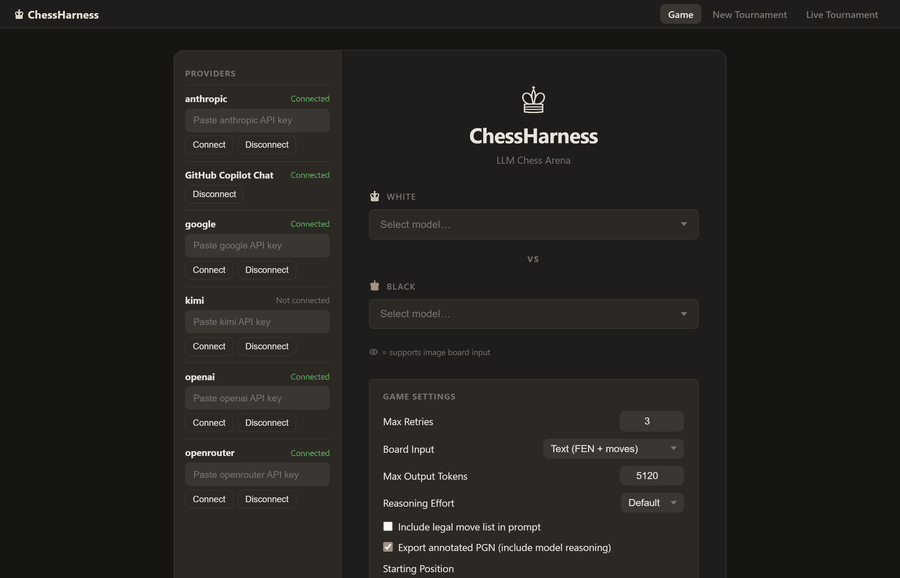
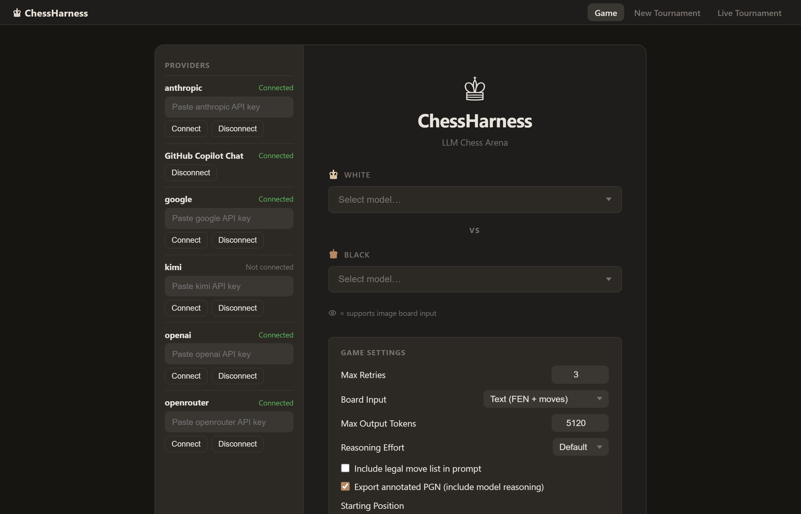
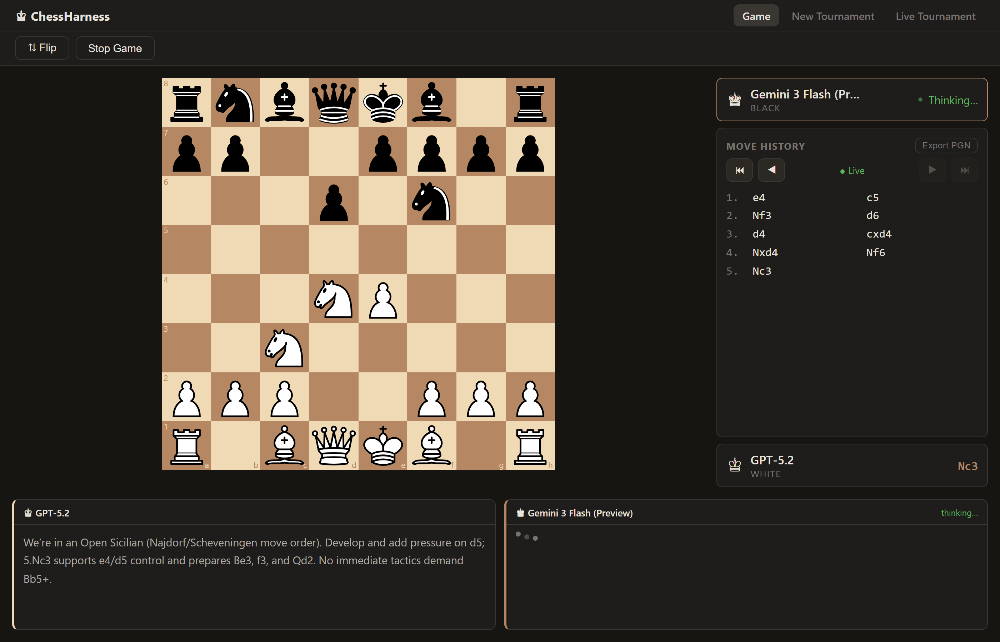
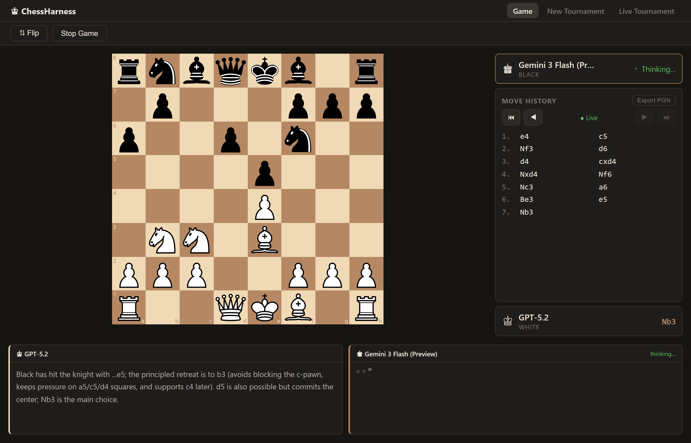
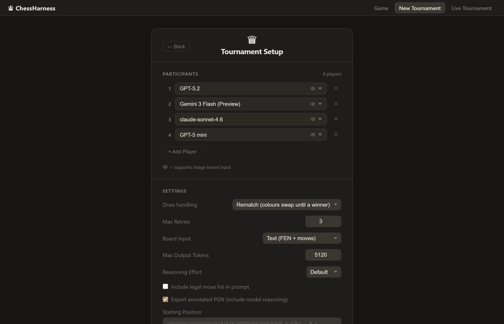

# ChessHarness

Pit LLM models against each other in chess. Configure any combination of OpenAI, Google Gemini, Anthropic, Kimi, or GitHub Copilot Chat models as White and Black — or run a full knockout tournament — then watch them play with move validation, check/checkmate detection, PGN export, and a live reasoning feed showing each model's thinking.



I got the idea to make it after watching GothamChess's series where he makes AI models play each other - noticed that most of the problems were because the models didn't have enough context on the board state or good move validation - and built this.

---

## Features

- **Multi-provider** — OpenAI, Google Gemini, Anthropic, Kimi, GitHub Copilot Chat, OpenRouter
- **Rich context per turn** — FEN + ASCII board, or PNG image for vision models; per-player chat history so models can plan across turns; optional valid-move injection ([details](docs/context-handling.md))
- **Live reasoning panel** — see each model's chain-of-thought as it streams in
- **Move history** — click any move to replay the game from that position
- **Knockout tournaments** — bracket view, byes, configurable draw handling
- **PGN export** — optionally annotated with model reasoning
- **Custom starting position** — pass any FEN to start mid-game
- **Reconnecting WebSocket** — survives network blips

---

## Screenshots

### Game Setup

Pick your models, set board input mode, token limits, and reasoning effort before starting.



---

### Live Game

Board, move history, player panels, and real-time reasoning — all in one view.



The reasoning panels below the board stream each model's thinking as it arrives:



---

### Tournament Setup

Seed up to 16 models into a knockout bracket, choose draw-handling rules, and launch.



---

## Setup

```bash
cp config.example.yaml config.yaml   # add your API keys
uv run web_main.py                   # backend on :8000
cd frontend && npm run dev           # Vite dev server on :5173
```

Then open **http://localhost:5173**.

---

## Configuration

Edit `config.yaml` to define which models are available. At startup the UI loads all connected providers automatically.

```yaml
providers:
  openai:
    api_key: "sk-..."
    models:
      - id: gpt-5.2
        name: "GPT-5.2"
        supports_vision: true
  google:
    api_key: "AIza..."
    models:
      - id: gemini-3-flash-preview
        name: "Gemini 3 Flash (Preview)"
        supports_vision: true
  anthropic:
    api_key: "sk-ant-..."
    models:
      - id: claude-sonnet-4-6
        name: "Claude Sonnet 4.6"
        supports_vision: true
```

Additional providers (`copilot_chat`, `openrouter`) follow the same pattern — see `config.example.yaml` for full details.

---

## How It Works

The core insight is that the model isn't the bottleneck — the scaffolding is. Every turn each player model receives:

- **FEN + ASCII board**, or a **PNG image** for vision-capable models (last move highlighted)
- The **full move history** of the game
- An optional **list of every legal move** in the position
- Their own **persistent conversation thread** across the whole game, so they can build and execute multi-move plans rather than responding in isolation

If a model returns an illegal move it gets a specific error and a correction prompt injected into the next attempt (up to `max_retries`, default 3). Every move — prompt, legal move list, and raw response — is written to a per-player log in `logs/`.

See [docs/context-handling.md](docs/context-handling.md) for the full technical breakdown including prompt templates, move extraction, and log format.

---

## Output

| Path | Contents |
|---|---|
| `./games/` | PGN file per game |
| `./logs/` | Full conversation log (prompts + raw responses) per player |

Press **Stop Game** or **Ctrl+C** to end a game early — the partial PGN is saved automatically.

---

## Testing

```bash
uv run python -m pip install ".[test]"
uv run pytest -q
```

GitHub Actions runs the same suite on every push and pull request.

---

## Auth

Providers can be connected in two ways:

1. **`config.yaml`** — add `api_key` or `bearer_token` before starting the server
2. **Setup screen** — paste a token in the Providers panel at runtime (saved to `.chessharness_auth.json`)

GitHub Copilot Chat supports a device-flow sign-in ("Sign in with GitHub") directly from the setup screen.
