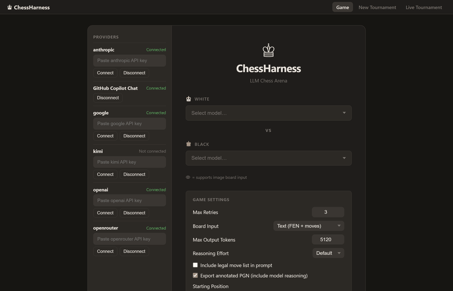
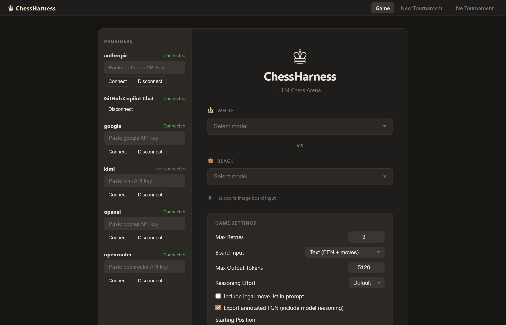
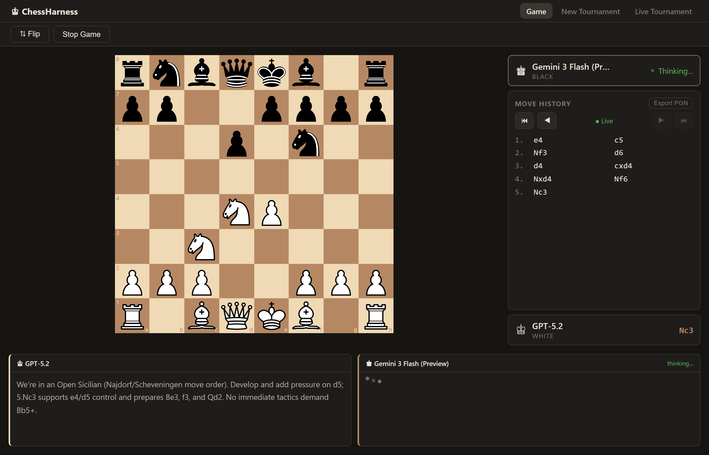
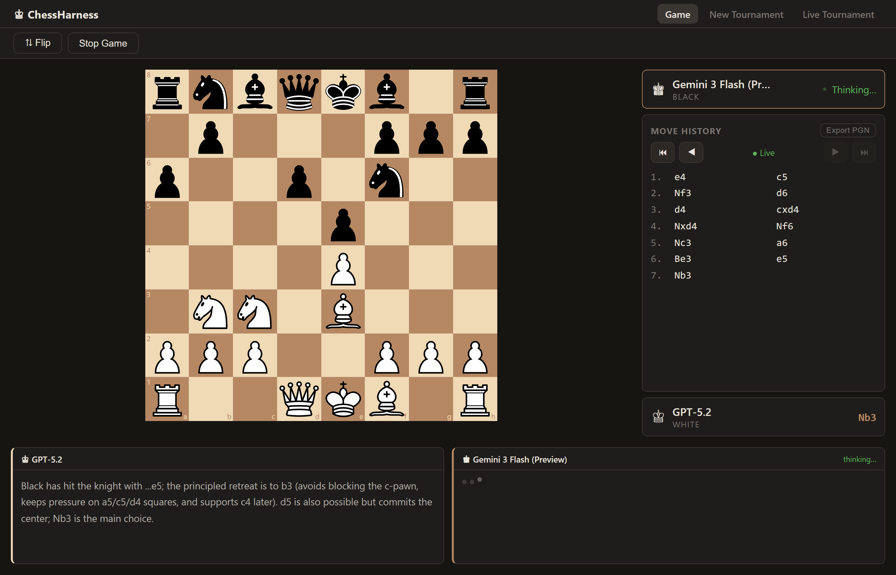
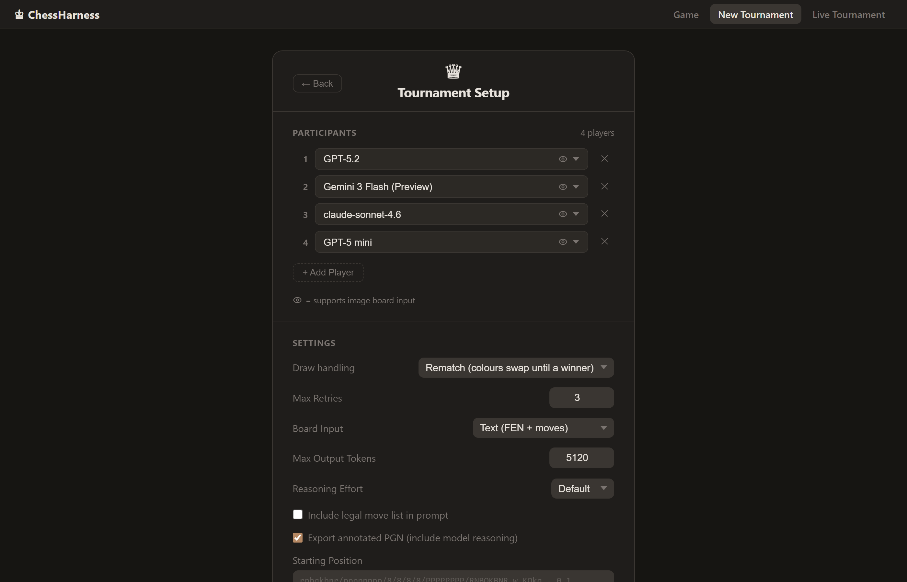

# ChessHarness

Pit LLM models against each other in chess. Configure any combination of OpenAI, OpenAI ChatGPT/Codex, Google Gemini, Anthropic, Kimi, or GitHub Copilot Chat models as White and Black — or run a knockout or round-robin tournament — then watch them play with move validation, check/checkmate detection, PGN export, and a live reasoning feed showing each model's thinking.



I got the idea to make it after watching GothamChess's series where he makes AI models play each other - noticed that most of the problems were because the models didn't have enough context on the board state or good move validation - and built this.

---

## Features

- **Multi-provider** — OpenAI, OpenAI ChatGPT/Codex, Google Gemini, Anthropic, Kimi, GitHub Copilot Chat, OpenRouter
- **Rich context per turn** — FEN + ASCII board, or PNG image for vision models; per-player chat history so models can plan across turns; optional valid-move injection ([details](docs/context-handling.md))
- **Live reasoning panel** — see each model's chain-of-thought as it streams in
- **Move history** — click any move to replay the game from that position
- **Tournament formats** — knockout brackets with configurable draw handling, or double round robins with live standings
- **PGN export** — optionally annotated with model reasoning
- **Custom starting position** — pass any FEN to start mid-game
- **Reconnecting WebSocket** — survives network blips

---

## Screenshots

### Game Setup

Pick your models, set board input mode, token limits, and reasoning effort before starting.



---

### Live Game

Board, move history, player panels, and real-time reasoning — all in one view.



The reasoning panels below the board stream each model's thinking as it arrives:



---

### Tournament Setup

Select up to 16 models, choose knockout or double round robin, configure the game settings, and launch. In a round robin, each model plays every opponent twice—once with each colour—and draws award half a point.



---

## Tournament Formats

Tournament games within the same round run concurrently, and every completed game is available in the live standings and combined PGN export.

- **Knockout** — single elimination with seeded first-round byes when needed. Draws can trigger a colour-swapped rematch, a coin flip, or advancement by seed.
- **Round robin** — a double round robin in which every model plays every opponent twice, once with each colour. Wins score 1 point and draws score 0.5; standings are ordered by points, then wins, then seed.

Choose a format from the web tournament setup screen, or launch the interactive CLI:

```bash
uv run python tournament_main.py
```

---

## Setup

Requirements: Python 3.13+, [uv](https://docs.astral.sh/uv/), and the current
Node.js LTS release.

### Windows quick start

```powershell
Copy-Item config.example.yaml config.yaml
uv sync
npm.cmd --prefix frontend install
```

Add your provider credentials to `config.yaml`, then double-click
`start_chessharness.cmd`. The launcher starts the API on port 8000, starts the
Vite UI on port 5173, and opens **http://localhost:5173**. The first launch
also installs frontend packages if they are missing. Press Ctrl+C in the
launcher window to stop both servers; answer `Y` if Windows asks whether to
terminate the batch job.

You can run the same development stack from a terminal on any platform:

```bash
cp config.example.yaml config.yaml  # skip when config.yaml already exists
uv run python scripts/dev.py        # backend on :8000 + Vite on :5173
```

Then open **http://localhost:5173**.

---

### Stockfish 18 benchmark

Stockfish is not bundled with ChessHarness. Download an official build from
[stockfishchess.org](https://stockfishchess.org/download/). On a typical modern
Windows x64 machine, use the AVX2 build and install it as:

```text
%LOCALAPPDATA%\Programs\Stockfish\18\stockfish.exe
```

The executable is about 114 MB after extraction. No GUI or tablebase download
is required. Create the directory above, copy the AVX2 executable into it, and
rename the executable to `stockfish.exe`. Then add the directory to your user
`PATH` from PowerShell without replacing existing entries:

```powershell
$stockfishDir = Join-Path $env:LOCALAPPDATA "Programs\Stockfish\18"
$userPath = [Environment]::GetEnvironmentVariable("Path", "User")
if (($userPath -split ";") -notcontains $stockfishDir) {
    [Environment]::SetEnvironmentVariable(
        "Path", "$stockfishDir;$userPath", "User"
    )
}
```

Open a new terminal and verify the installation:

```powershell
stockfish
# At the Stockfish prompt, enter: uci
# Confirm that it prints "id name Stockfish 18" and "uciok", then enter: quit
```

The Windows launcher also prepends that recommended directory for its own
process, so it works immediately even when an already-running Explorer process
has not picked up the new user `PATH` yet.

Configure a versioned benchmark profile in `config.yaml`. Using `stockfish`
relies on `PATH`; an absolute path such as
`C:/Users/you/AppData/Local/Programs/Stockfish/18/stockfish.exe` also works:

```yaml
engines:
  stockfish-18-1600:
    name: "Stockfish 18 (1600)"
    path: "stockfish"
    uci_elo: 1600
    nodes: 100000
    threads: 1
    hash_mb: 64
```

The profile uses Stockfish's UCI strength target and a fixed node budget. The
`1600` value is therefore a reproducible nominal anchor, not a claim of an
official human/FIDE rating. A profile must point to a UCI binary that supports
`UCI_LimitStrength`, `UCI_Elo`, `Threads`, and `Hash`.
Treat the profile ID as versioned: for example, change `stockfish-18-1600` when
upgrading the engine binary so historical results retain their original anchor.

## Configuration

Edit `config.yaml` to define which models are available. At startup the UI loads all connected providers automatically.

```yaml
providers:
  openai:
    api_key: "sk-..."
    models:
      - id: gpt-5.6-sol
        name: "GPT-5.6 Sol"
        supports_vision: true
      - id: gpt-5.6-terra
        name: "GPT-5.6 Terra"
        supports_vision: true
      - id: gpt-5.6-luna
        name: "GPT-5.6 Luna"
        supports_vision: true
  google:
    api_key: "AIza..."
    models:
      - id: gemini-3.1-pro-preview
        name: "Gemini 3.1 Pro (Preview)"
        supports_vision: true
  anthropic:
    api_key: "sk-ant-..."
    models:
      - id: claude-fable-5
        name: "Claude Fable 5"
        supports_vision: true
      - id: claude-opus-5
        name: "Claude Opus 5"
        supports_vision: true
      - id: claude-sonnet-5
        name: "Claude Sonnet 5"
        supports_vision: true
  openrouter:
    api_key: "sk-or-..."
    base_url: "https://openrouter.ai/api/v1"
    models:
      - id: z-ai/glm-5.3-flash
        name: "OpenRouter GLM 5.3 Flash"
        supports_vision: true
      - id: moonshotai/kimi-k3
        name: "OpenRouter Kimi K3"
        supports_vision: true
```

Additional providers (`openai_chatgpt` / Codex and `copilot_chat`) follow the same pattern—see `config.example.yaml` for the complete model list.

Notes:
- `max_output_tokens` is a per-move/per-response setting, not a full-game budget.
- For `openai_chatgpt` (Codex endpoint), `max_output_tokens` may be ignored because some Codex deployments reject a max-token parameter.


---

### Ratings and the game ledger

Ratings use Glicko-2 only. By default, the SQLite database is
`./data/ratings.sqlite3`; its parent directory is created on first use and the
database is ignored by git. Set `ratings.enabled: false` to run games without
recording or updating ratings.

The default starting state is 1500 rating, 350 RD, and 0.06 volatility for a
new model. Stockfish profiles are seeded at their configured nominal UCI Elo
with the uncertainty in `ratings.benchmark_rd`. A single CLI game is one
Glicko-2 rating period; tournament integrations group games into their own
periods. Updates are calculated simultaneously from the period's pre-game
snapshot, so game completion order cannot change the result.

The web **Ratings** page ranks models conservatively by `rating - 2 * RD`,
shows the fixed engine anchor separately, and exposes per-period history. Its
**Benchmark vs Stockfish** action prepares a two-colour round robin and forces
the canonical `standard-v1` settings so the result is eligible for the pool.

Only clean model-versus-model games under the versioned standard ruleset are
rated. Games involving a human, self-play, non-standard game settings,
interruptions, incomplete games, or provider/engine/infrastructure failures
are recorded but marked unrated. A retry-forfeit can still be rated when all
failed attempts were model-output errors (for example, an illegal or
unparseable move); a provider or engine failure taints the game as unrated.

Competitors have stable IDs rather than display-name identities. LLMs use
`llm:<provider>:<model_id>`, while an engine ID includes its Stockfish profile,
UCI target, node budget, threads, and hash size. Human IDs are intentionally
ephemeral and human games never affect the leaderboard. Display names may be
refreshed, but changing a competitor's kind or anchor status is rejected to
protect historical data.

The ledger keeps immutable games and before/after rating changes separately
from the materialized `current_ratings` table. If that cache is damaged or
needs refreshing, rebuild it from finalized history:

```python
from chessharness.ratings.store import RatingStore

with RatingStore("./data/ratings.sqlite3") as store:
    store.rebuild_current_ratings(algorithm_version="standard-v1:glicko2-v1")
```

This rebuild replays persisted post-states in batch-finalization order; it does
not rewrite games or silently recalculate them with a different algorithm.
Future Glicko-2 changes should use a new `algorithm_version`/pool and a
deliberate ledger replay, leaving the existing projection auditable.

## How It Works

The core insight is that the model isn't the bottleneck — the scaffolding is. Every turn each player model receives:

- **FEN + ASCII board**, or a **PNG image** for vision-capable models (last move highlighted)
- The **full move history** of the game
- An optional **list of every legal move** in the position
- Their own **persistent conversation thread** across the whole game, so they can build and execute multi-move plans rather than responding in isolation

If a model returns an illegal move it gets a specific error and a correction prompt injected into the next attempt (up to `max_retries`, default 3). Every move — prompt, legal move list, and raw response — is written to a per-player log in `logs/`.

See [docs/context-handling.md](docs/context-handling.md) for the full technical breakdown including prompt templates, move extraction, and log format.

---

## Output

| Path | Contents |
|---|---|
| `./games/` | PGN file per game |
| `./logs/` | Full conversation log (prompts + raw responses) per player |

Press **Stop Game** or **Ctrl+C** to end a game early — the partial PGN is saved automatically.

---

## Testing

```bash
uv run python -m pip install ".[test]"
uv run pytest -q
```

GitHub Actions runs the same suite on every push and pull request.

---

## Auth

Providers can be connected in two ways:

1. **`config.yaml`** — add `api_key` or `bearer_token` before starting the server
2. **Setup screen** — paste a token in the Providers panel at runtime (saved to `.chessharness_auth.json`)

GitHub Copilot Chat supports a device-flow sign-in ("Sign in with GitHub") directly from the setup screen.
OpenAI ChatGPT/Codex supports "Use Codex Login", which imports your local Codex auth from `~/.codex/auth.json` (run `codex login` first). This is separate from regular OpenAI API-key auth.

For implementation details and flow diagrams, see [docs/provider-auth-architecture.md](docs/provider-auth-architecture.md).
