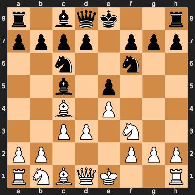

# Context Handling

From watching Levy (GothamChess) recap his AI tournament videos I noticed a few recurring problems — models making illegal moves, blundering pieces that weren't under attack, losing track of what they'd played several moves ago, teleporting pieces across the board and summoning new pieces from out of the ether. The raw model wasn't the bottleneck; the harness (or lack thereof) was.

This mirrors what we've seen in other domains. Claude Code and GitHub Copilot/Codex don't make the underlying models smarter — they make them dramatically more effective at programming by giving them the right context at the right time: the file tree, the relevant code, the compiler error, the test output. Strip that away and ask the same model to write code blind and the results are far worse. The model is the same; the scaffolding is doing real work.

Chess is no different. ChessHarness is built around that idea, addressing the context problems with the following mechanisms.

---

## Board State Representation

At every turn the active player receives an explicit snapshot of the current position. The format depends on the `board_input` setting in `config.yaml`.

### Text mode (`board_input: text`)

The prompt includes both a FEN string and a human-readable ASCII diagram:

```
Position (FEN): rnbqkbnr/pppppppp/8/8/4P3/8/PPPP1PPP/RNBQKBNR b KQkq - 0 1

Board (you are BLACK, uppercase = White, lowercase = Black):
r n b q k b n r
p p p p p p p p
. . . . . . . .
. . . . . . . .
. . . . P . . .
. . . . . . . .
P P P P . P P P
R N B Q K B N R
```

The FEN gives the model a dense, unambiguous machine-readable state (active colour, castling rights, en passant square, half-move clock). The ASCII diagram gives it a spatial layout. Both together reduce the chance of the model misreading the position.

### Image mode (`board_input: image`)

When the selected model has `supports_vision: true`, a PNG of the board is rendered and sent as a vision attachment instead. Here's what the model sees for the position above (Italian Game, move 5):



The last move is highlighted with a red arrow so the model can immediately see what just happened. The FEN is always included alongside the image — it's not a replacement, it's additional signal.

If rendering fails, or the model doesn't support vision, ChessHarness falls back to text automatically with no intervention required.

---

## Per-Player Conversation Threads

Each player has its own independent message history that grows across the entire game. Rather than sending a single isolated prompt per turn, ChessHarness appends each turn to that player's thread and sends the whole conversation on the next request.

The structure at turn N looks like:

```
[system]         ← static system prompt
[user]           ← "[Move 1 — WHITE]"  (compact label)
[assistant]      ← model's move 1 response
[user]           ← "[Move 2 — WHITE]"
[assistant]      ← model's move 2 response
  ...
[user]           ← current full board state (FEN + ASCII / image)
```

The full board state is only sent in the current turn's user message — history entries use compact turn labels rather than repeating the entire FEN and diagram, keeping token usage efficient while preserving the model's sense of what it has played and why.

The two players' threads are completely separate. Neither model can see the other's reasoning.

---

## System Prompt & Structured Output

Every player receives a system prompt that establishes the format the response must follow:

```
You are playing chess as white (WHITE pieces) in a standard game.

Respond in this exact format — two sections, nothing else:

## Reasoning
Think through the position: threats, tactics, your plan. Be concise.

## Move
Your chosen move in SAN notation (e.g. e4, Nf3, cxd4, O-O, O-O-O, e8=Q)

Rules for the ## Move section:
- One move only, on its own line
- It MUST be from the legal moves list you are given
- Use SAN notation (e.g. e4, Nf3, cxd4, O-O, O-O-O, e8=Q)
```

Separating `## Reasoning` from `## Move` serves two purposes: it gives the model space to think before committing to a move, and it makes the move trivially extractable without having to parse free-form prose.

> **Note:** The prompt asks for SAN, but the harness accepts UCI too (e.g. `e2e4`, `g1f3`). The move extraction pipeline tries both formats, so models that prefer UCI notation will still work correctly.

### Move extraction

ChessHarness parses the response by splitting on markdown headers, identifying the `## Move` section by keyword, then running two regexes in sequence — UCI first (`e2e4`, `a7a8q`), SAN second (`Nf3`, `O-O`, `exd4`) — before falling back to the first whitespace-delimited token. The extracted string is then validated by python-chess independently of whatever format was used.

---

## Legal Move Injection

When enabled (the default), the current position's full list of legal moves is appended to the user message in SAN notation:

```
Legal moves (30):
Ne7, Nh6, Nf6, Be7, Bd6, Bc5, Bb4+, Ba3, Ke7, Qe7, Qf6, Qg5, Qh4, Nc6,
Na6, exd4, h6, g6, f6, d6, c6, b6, a6, h5, g5, f5, d5, c5, b5, a5
```

The system prompt rule is also tightened to `It MUST be from the legal moves list you are given`. This is the single most effective lever for reducing illegal move rates — the model no longer has to generate a legal move from scratch, it just has to select one.

It can be disabled per-game from the setup screen, which is occasionally useful for testing how a model performs under more adversarial conditions.

---

## Retry & Correction

If a model returns an invalid move, ChessHarness doesn't immediately forfeit — it retries up to `max_retries` times (configurable, default 3). On each retry the model's previous attempt and the reason it was rejected are injected back into the user message:

```
## Correction
Your previous move "Nxd4" was rejected.
Reason: 'Nxd4' is not a recognised move. Use UCI (e.g. e2e4, a7a8q) or SAN (e.g. e4, Nf3, cxd4, O-O).
You must choose a different, valid move.
```

Validation runs in two stages. First the move string is checked for recognised format (UCI or SAN). If it parses, it is then checked for legality in the current position. The error message is specific to which stage failed, so the model gets actionable feedback rather than a generic rejection. If all retries are exhausted, the player forfeits the game.

---

## Per-Model Conversation Logs

Every game produces two log files in `logs/` — one per player — capturing the full request and response for every move. The filename encodes the game timestamp, colour, and model name:

```
logs/
├── game_20260226_142830_white_OpenAI o3.log
└── game_20260226_142830_black_GPT-5_2.log
```

Each move block looks like this:

```
================================================================================
  BLACK | Move 1 | Attempt 1
  14:32:41
================================================================================

[SYSTEM]
You are playing chess as black (BLACK pieces) in a standard game.
...

[USER]
Position (FEN): rnbqkbnr/pppppppp/8/8/4P3/8/PPPP1PPP/RNBQKBNR b KQkq - 0 1

Board (you are BLACK, uppercase = White, lowercase = Black):
r n b q k b n r
p p p p p p p p
. . . . . . . .
. . . . . . . .
. . . . P . . .
. . . . . . . .
P P P P . P P P
R N B Q K B N R

Move history (1 half-moves):
e4
Legal moves (20):
Nh6, Nf6, Nc6, Na6, h6, g6, f6, e6, d6, c6, b6, a6, h5, g5, f5, e5, d5, c5, b5, a5

--------------------------------------------------------------------------------
[RESPONSE]
## Reasoning
After 1.e4, stake a claim in the center and open lines for development. The most
principled response is 1...e5, mirroring White and enabling rapid piece activity.

## Move
e5
```

Vision moves log the image as `<image: N bytes>` rather than storing binary. The logs are append-only and written in real time, so a game interrupted mid-way still produces a complete record of everything up to that point.
